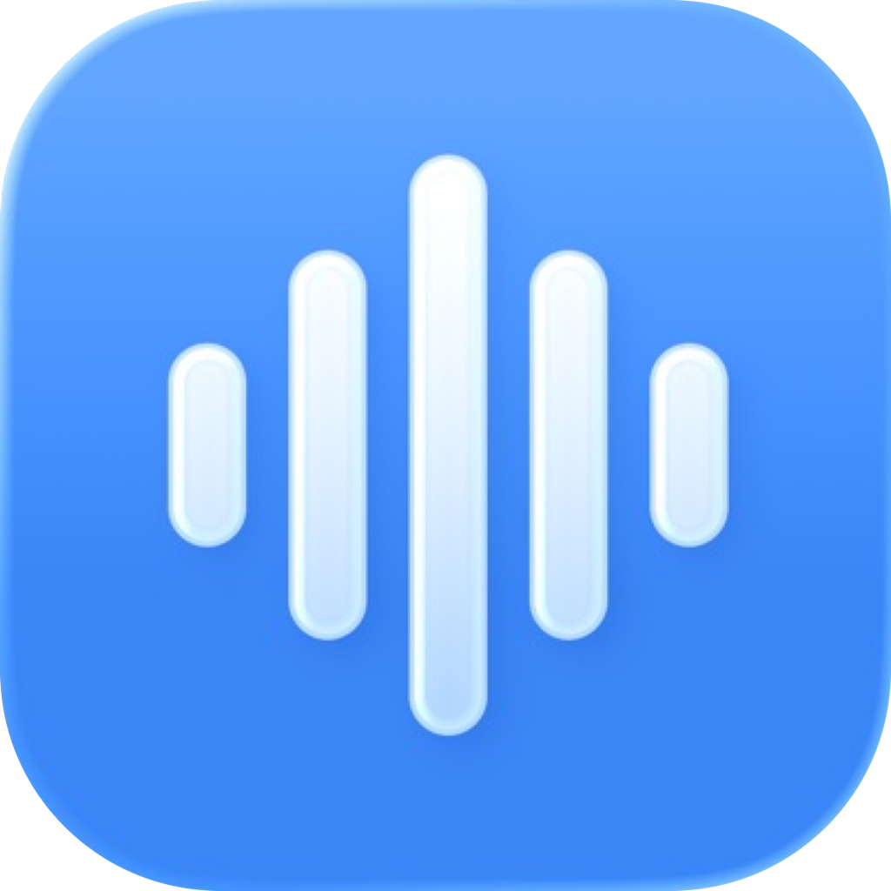

# Entrevoix



Entrevoix is a privacy-conscious voice dictation app designed to live quietly in
the macOS menu bar.

## Contents

- [Dictation that respects your flow — and your privacy](#dictation-that-respects-your-flow--and-your-privacy)
- [Features](#features)
- [How It Works](#how-it-works)
- [Privacy](#privacy)
- [Getting Started](#getting-started)
- [Configuration](#configuration)
- [Requirements](#requirements)
- [Development](#development)
- [Project Status](#project-status)
- [Preparing a Release](#preparing-a-release)
- [License](#license)

## Dictation that respects your flow — and your privacy

Your ideas should move as quickly as you can speak them. Dictation should feel
natural, stay out of the way, and never force you to give up control of your
voice, your text, or the services that process them.

Entrevoix lives quietly in the macOS menu bar. Press a global shortcut, speak,
and let your chosen local or OpenAI-compatible provider transcribe your words.
The result can optionally be improved, then copied or inserted directly into
the app you are using.

You choose the providers, endpoints, models, and output behavior. Entrevoix
stores secrets in the macOS Keychain, removes temporary recordings after every
dictation, and has no account or server of its own.

Entrevoix combines push-to-talk and toggle shortcuts, local and remote
transcription providers, optional text cleanup, and automatic insertion in a
lightweight macOS app.

## Features

### Dictate naturally

- Start dictation from anywhere with a push-to-talk or toggle shortcut.
- Follow the recording and transcription state through a discreet floating
  indicator positioned near the caret.
- Send the result to the clipboard or insert it automatically into the active
  field.
- Cancel an active permission request, recording, or transcription with Escape.

### Choose how your words are processed

- Use Apple Speech locally or configure OpenAI and other OpenAI-compatible
  speech-to-text providers.
- Optionally improve a transcript through the Responses API or Chat Completions.
- Keep the raw transcript automatically if text cleanup fails.
- Test an STT connection with a short recording before using it for dictation.

### Stay in control

- Store API keys in the macOS Keychain.
- Configure endpoints and models with local validation.
- Follow the system language or switch the interface between English and French
  without relaunching the app.
- Enable launch at login and sound feedback when desired.
- Inspect safe, in-memory diagnostic logs from a dedicated window.

## How It Works

1. Press your global shortcut and start speaking.
2. Entrevoix records a temporary 16 kHz mono WAV file.
3. Your selected provider transcribes the recording.
4. If enabled, your selected text provider improves the transcript.
5. Entrevoix copies the result or inserts it into the active field, then deletes
   the temporary recording.

Dictations shorter than 250 ms are rejected, and a watchdog stops recordings
after 10 minutes. Secure fields and missing Accessibility permission always fall
back to copying the result to the clipboard.

## Privacy

- API keys are stored in the macOS Keychain, never in `UserDefaults` or logs.
- Audio is created in the macOS temporary directory and deleted after every
  transcription, whether it succeeds, fails, or is canceled.
- Entrevoix has no accounts or servers of its own: remote audio and, when
  enabled, text are sent only to the selected endpoints. Apple Speech and Apple
  Foundation Models remain local and never silently fall back to a remote model.
- Remote model discovery is explicit, held only in memory, and does not infer a
  model's STT or TTT compatibility.
- The Logs window keeps events only in memory and displays no secrets, audio,
  transcripts, or prompts.
- Ephemeral networking rejects cross-origin redirects so authorization headers
  cannot leak to another origin.

## Getting Started

On first launch, Entrevoix opens a five-step guide that helps you:

1. choose the interface language and review the privacy model;
2. select and configure a transcription provider;
3. optionally test the connection;
4. configure a global shortcut and trigger mode;
5. choose the delivery mode and other preferences.

The STT test requests microphone access, records a short phrase, then processes
it with the selected provider. Apple Speech stays entirely on-device; remote
profiles use their configured OpenAI-compatible endpoint. The test never runs in
the background.

All choices remain editable later from **Settings** in the menu bar.

## Configuration

### Providers

Entrevoix includes a shared provider catalogue for Apple Speech, OpenAI, and
OpenAI-compatible profiles. Remote providers can use custom endpoints and
models. API keys remain in the macOS Keychain.

### Output

Choose between **Clipboard Only** and **Insert Automatically**. Automatic
insertion requires Accessibility permission. Without it—and whenever a secure
field is focused—Entrevoix keeps the transcript on the clipboard instead.

### Launch at login

The option is available under **Settings > General**. macOS may request
permission or require the application to be installed as a signed bundle; the
development script is not the final distribution method.

## Requirements

- macOS 26 or later;
- microphone permission for recording;
- Accessibility permission for automatic insertion;
- an API key when using a provider that requires one.

Building Entrevoix additionally requires Xcode 26 with `xcstringstool`, Swift
6.3, and the macOS 26 SDK. The Command Line Tools alone are not sufficient for
launching, testing, or releasing the complete localized app bundle.

## Development

Build and launch a real development app bundle. By default, the script uses the
`../Entrevoix.provisionprofile` Developer ID profile, which must authorize the
`iCloud.app.entrevoix.shared` CloudKit container:

```shell
./Scripts/run-app.sh
```

Set `ENTREVOIX_PROVISIONING_PROFILE_PATH` only when using a profile from a
different location.

The script assembles `Entrevoix.app`, applies its `Info.plist`, embeds the
required frameworks and resources, signs it locally, and launches it through
LaunchServices. Use it to test windows, global shortcuts, permissions, and other
macOS integration behavior.

> [!IMPORTANT]
> Do not use `swift run Entrevoix` to validate application behavior. It launches
> a raw executable without the app metadata, entitlements, embedded frameworks,
> localization catalogs, stable signature, or LaunchServices behavior.

Select the full Xcode toolchain with `xcode-select` or `DEVELOPER_DIR` before
running the app scripts.

To assemble and verify the development bundle without opening it:

```shell
ENTREVOIX_SKIP_OPEN=1 ./Scripts/run-app.sh
```

The verification checks that the app contains `Sparkle.framework`, has the
correct framework search path, includes its localized resources, and passes
code-signature validation.

Run the test suite with warnings treated as errors:

```shell
swift test -Xswiftc -warnings-as-errors
```

The global-shortcut handler is installed after the macOS event loop starts so
saved shortcuts remain active after relaunching the app.

## Project Status

Milestone J8 provides the current Swift 6 app targeting macOS 26. The app uses a
lightweight hexagonal architecture: its `Entrevoix` executable target depends on
the exact tagged `EntrevoixCore`, `EntrevoixOpenAIAdapters`, and
`EntrevoixAppleAdapters` products from `entrevoix-shared`. Its macOS presentation
and system-integration adapters remain local to this repository.

The current implementation includes the complete dictation flow, provider
configuration, optional text cleanup, clipboard and Accessibility delivery,
first-launch onboarding, live localization, permission controls, in-memory
logs, Sparkle integration, and automated domain, application, infrastructure,
localization, and coverage tests.

Some macOS integration checks still require manual validation with a signed app,
particularly global keyboard events, microphone and Accessibility prompts,
cross-application insertion, caret positioning, and secure-field fallback.

## Preparing a Release

On a machine with Xcode and a Developer ID identity, `Scripts/release.sh`
produces a signed and notarized DMG and reports its SHA-256 digest. The GitHub
**Release** workflow can also be run manually to produce the DMG, generate and
sign the Sparkle appcast, and publish a GitHub release using an App Store Connect
Team API key.

The release workflow requires a base64-encoded `DEVELOPER_ID_PROVISIONING_PROFILE_BASE64`
secret. This profile must authorize the `iCloud.app.entrevoix.shared` CloudKit
container and is embedded in the signed app bundle. Renew the profile before
it expires: Gatekeeper validates Developer ID provisioning profiles for apps
using advanced capabilities at every launch.

See the detailed [release checklist](docs/RELEASE_CHECKLIST.md).

## License

Entrevoix is distributed under the MIT License. See [LICENSE](LICENSE).
Dependency notices are available in
[THIRD_PARTY_NOTICES.md](THIRD_PARTY_NOTICES.md).
